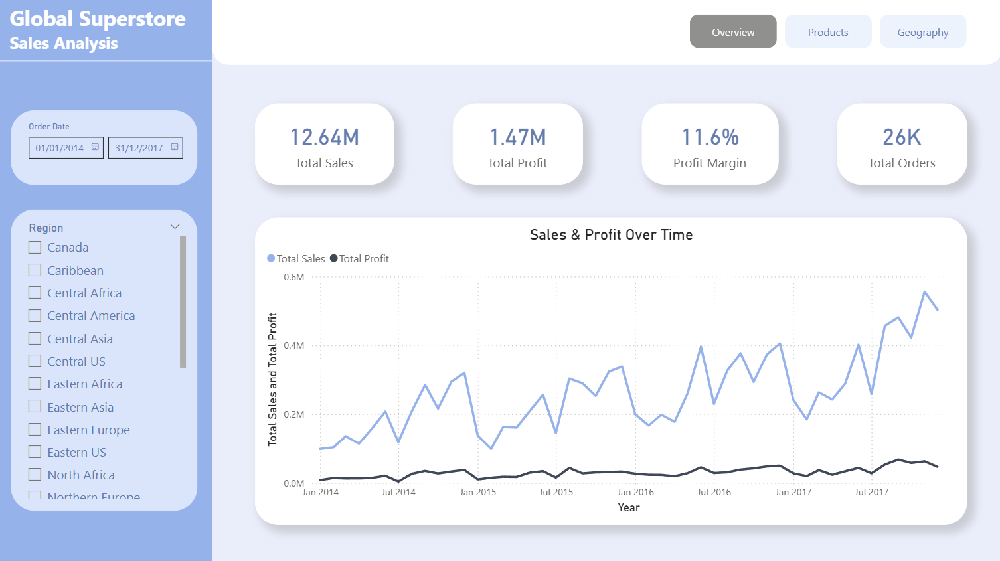
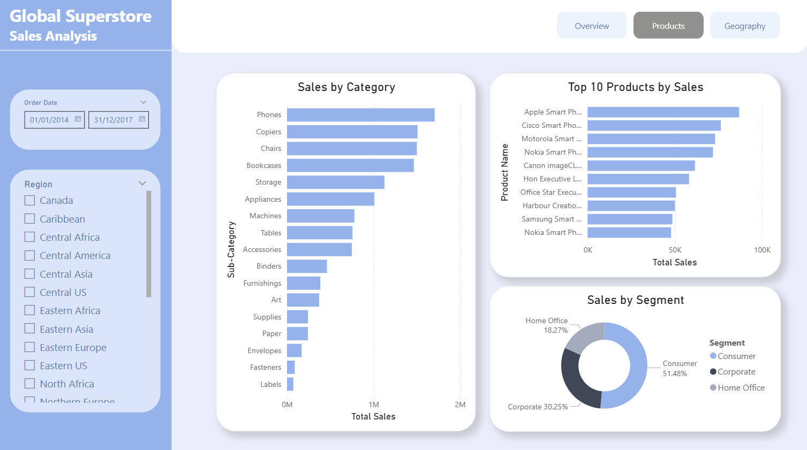
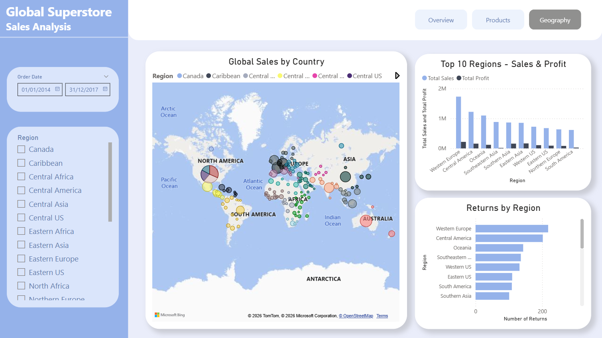

# Global Superstore - Sales Analysis Dashboard

An interactive 3-page Power BI report analyzing retail sales performance of a global superstore across 2014–2017. The dashboard covers overall business KPIs, product-level insights, and geographic distribution of sales and returns.

---

## Dashboard Preview

### Overview


### Products


### Geography


---

## Dashboard Pages

### 1. Overview
- KPI cards: Total Sales, Total Profit, Profit Margin, Total Orders
- Line chart showing Sales & Profit trend over time (2014–2017)
- Interactive date range slicer and region filter

### 2. Products
- Horizontal bar chart - sales breakdown by sub-category
- Top 10 best-selling products by revenue
- Donut chart - sales distribution by customer segment (Consumer, Corporate, Home Office)

### 3. Geography
- Bubble map - global sales by country with region color coding
- Clustered column chart - Sales & Profit by region
- Bar chart - number of returns per region

---

##  Dataset

**Source:** [Global Superstore Data - Kaggle](https://www.kaggle.com/datasets/rohitgrewal/global-superstore-data)

| Table | Description |
|---|---|
| Orders| Main fact table - orders, products, customers, sales, profit |
| Returns | Returned order IDs with region |
| People | Regional managers assigned to regions |


---

## Data Model

The report uses a star-schema-like model with the following relationships:
- `Returns[Order ID]` -> `Orders[Order ID]` (Many to One)
- `People[Region]` -> `Orders[Region]` (Many to One)

---

## DAX Measures

```DAX
Total Sales = SUM(Orders[Sales])

Total Profit = SUM(Orders[Profit])

Profit Margin = DIVIDE([Total Profit], [Total Sales], 0)

Total Orders = DISTINCTCOUNT(Orders[Order ID])

Total Returns = COUNTROWS(Returns)
```


## Tools & Technologies

- **Power BI Desktop** - report building and publishing
- **Power Query** - data cleaning and transformation
- **DAX** - calculated measures
- **Kaggle** - data source

---

## Key Insights

- Sales grew consistently year-over-year, with the strongest growth in Q4 2017
- **Western Europe** generates the highest revenue but also leads in number of returns
- **Phones** and **Copiers** are the top-performing sub-categories by revenue
- **Consumer segment** accounts for over 51% of total sales
- Overall Profit Margin is ~12%, with room for improvement in low-margin categories

---

## How to Use

1. Download the `.pbix` file from this repository
2. Open it in [Power BI Desktop](https://powerbi.microsoft.com/desktop/) (free)
3. Use the **date slicer** and **region filter** on the left panel to explore the data interactively
4. Navigate between pages using the **Overview / Products / Geography** buttons in the top right corner
